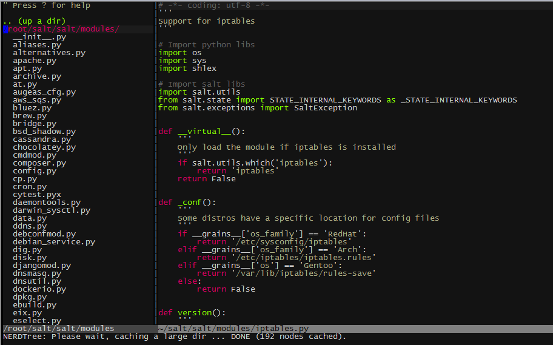
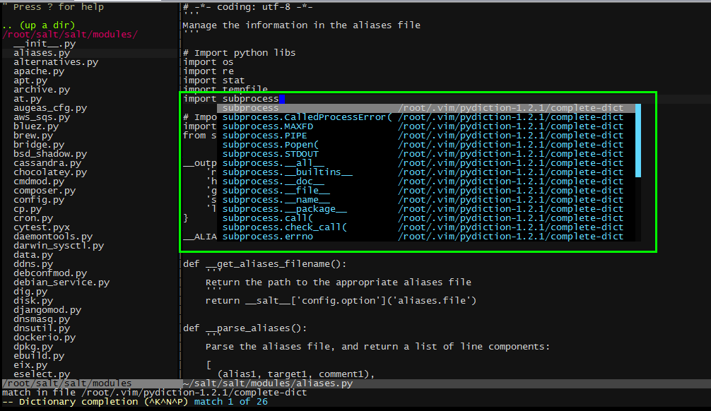

linux系统，windows的没有研究过，可能路径不同    
git clone https://github.com/itnihao/vimrc-python.git   
cd vimrc-python   
mv ~/.vimrc ~/.vimrc.old   
cp .vimrc ~/.vimrc   
cd  ../
mv vimrc-python  ~/.vim   
yum install ctags   (F3这个功能) 
   
vim python插件   
支持 tab键盘自动补齐自带的函数，类   
F3 显示类，函数   
F4 显示文件目录   
F11 插入头部文件   
F12 执行python文件   
cc: 检查python语法是否正确   
ctrl+x,ctrl+o 自动补齐写过的类   
内置saltstack的vimrc
光标键按K会出帮助文件(有点bug，是man，不是pydoc)

截图1   

截图2    

